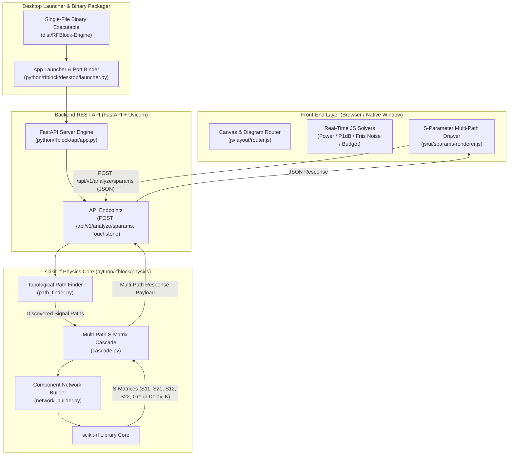
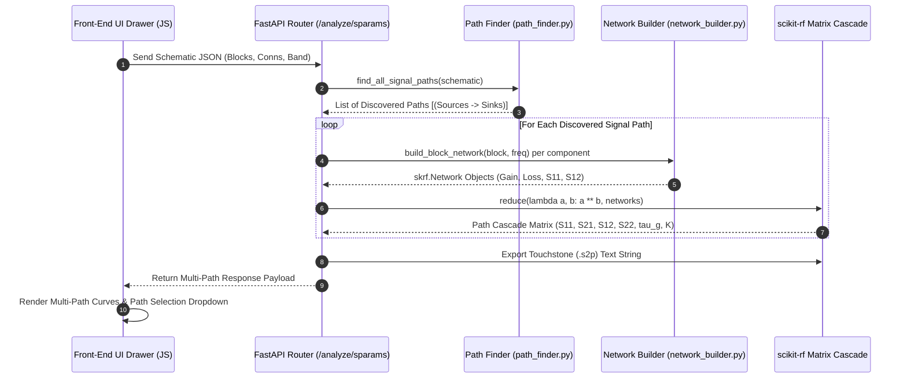
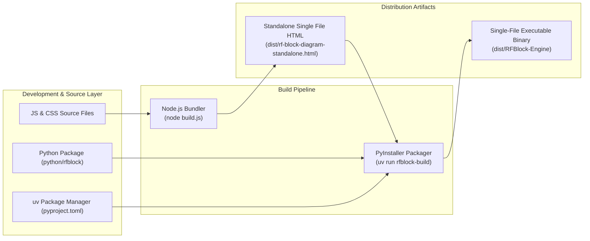

# Software Architecture — RF Chain Block Diagram Editor & Physics Engine

This document details the architectural design, module breakdown, solver algorithms, topological graph algorithms, `scikit-rf` matrix solver, UV package management, and data flow of the RF Chain Block Diagram Editor.

---

## 🏛️ System Design Principles

1. **Modular Architecture & UV Package Management**: Managed via `uv` package manager with `pyproject.toml` definition, exposing CLI entry points (`rfblock`, `rfblock-build`).
2. **Declarative Component Registry**: Components define properties, ports, parameters, noise figure, $P_{1\text{dB}}$ limits, and IEEE 315 SVG symbols (`sym()`) declaratively in `js/components.js`.
3. **Dual Physics Solvers**:
   - **Frontend (JS)**: Real-time interactive solvers for power levels, $P_{1\text{dB}}$ compression capping, noise figures, and cascaded IP3.
   - **Backend (Python / `scikit-rf`)**: Decoupled high-precision matrix solver engine for multi-frequency $S$-parameter cascades ($S_{11}, S_{21}, S_{12}, S_{22}$), Group Delay ($\tau_g$), Rollett stability factor ($K$), and Touchstone `.s2p` export.
4. **Topological Graph Path Finder**: Directed port graph solver $G=(V, E)$ in `python/rfblock/physics/path_finder.py` that discovers all valid signal pathways from Sources to Sinks across multi-throw switches, splitters, combiners, and parallel channels.
5. **Single-File Zero-Setup Executable**: Compiles into `dist/RFBlock-Engine` binary via PyInstaller, embedding FastAPI + Uvicorn + `scikit-rf` + Web UI with auto-launching desktop window / browser interface.

---

## 📊 System Architecture Diagrams

### 1. High-Level System Architecture



---

### 2. Multi-Path Cascading S-Parameter Data Flow



---

### 3. Packaging & Distribution Pipeline



---

## 📁 Directory & Module Breakdown

```
RFBlock/
├── pyproject.toml                     # Modern UV project definition & dependencies
├── uv.lock                            # UV lockfile for reproducible builds
├── index.html                         # Main application entry point & UI shell
├── build.js                           # Node.js bundler script for standalone HTML packaging
├── css/
│   └── styles.css                     # Dark/light theme variables, toolbar, canvas & SVG styles
├── js/                                # Modular JS frontend
│   ├── config.js                      # Category tints (TYPE_TINT), swatches, default settings
│   ├── utils.js                       # String escaping (esc), number formatting (fmt, dbm)
│   ├── components.js                  # Declarative component registry & IEEE 315 SVG glyphs
│   ├── state.js                       # Central state (blocks, conns, sheets), history, clipboard
│   ├── geometry.js                    # Vector math, bounding boxes (bboxOf), port point transforms
│   ├── subsystems.js                  # Multi-sheet subsystem hierarchy & off-page tag resolution
│   ├── layout/
│   │   └── router.js                  # Orthogonal wire routing, obstacle avoidance, pill placement
│   ├── solvers/
│   │   ├── power-solver.js            # Fixed-point signal power solver with P1dB compression capping
│   │   ├── noise-solver.js            # Cascaded Friis Noise Figure calculation engine
│   │   ├── sparams-solver.js          # In-browser S-parameter matrix solver & parser
│   │   └── budget-solver.js           # Waterfall power budget drawer & Design Rule Checker (DRC)
│   ├── io/
│   │   ├── xlsx-exporter.js           # Binary Uint8Array ZIP/XLSX BOM workbook generator
│   │   └── file-io.js                 # File System Access API, JSON save/load, SVG/PNG exporter
│   └── ui/                            # Renderers, drawers, context menus, drag interactions
└── python/                            # Scalable Python Backend Package
    └── rfblock/
        ├── __init__.py                # Package version & metadata
        ├── __main__.py                # Module execution entry (python -m rfblock)
        ├── cli.py                     # CLI entry points (rfblock, rfblock-build)
        ├── core/                      # Core utilities & configuration
        │   ├── __init__.py
        │   └── config.py              # Application settings & asset resource path loader
        ├── physics/                   # RF Physics & scikit-rf Matrix Engine
        │   ├── __init__.py
        │   ├── path_finder.py         # Topological graph path discovery G=(V,E) (Sources -> Sinks)
        │   ├── network_builder.py     # Converts schematic JSON into skrf.Network objects
        │   ├── cascade.py             # Multi-path S-parameter matrix cascade & de-embedding
        │   └── touchstone.py          # Touchstone file generator (.s1p through .sNp)
        ├── api/                       # FastAPI REST Layer
        │   ├── __init__.py
        │   ├── app.py                 # FastAPI application factory
        │   ├── schemas/               # Pydantic request & response validation schemas
        │   └── routes/                # Modular API endpoints (health, sparams, touchstone)
        ├── desktop/                   # Desktop Launcher & Packaging
        │   ├── __init__.py
        │   ├── launcher.py            # Local port binder & PyWebView / browser launcher
        │   └── packager.py            # PyInstaller single-file binary packager
        └── tests/                     # Physics Unit Tests
            ├── __init__.py
            └── test_physics.py        # Path discovery & cascade matrix calculation tests
```

---

## ⚡ Core Engine & Solver Algorithms

### 1. Power Level Solver (`js/solvers/power-solver.js`)
Calculates RF power levels at every port using a fixed-point iterative solver (`computePowersRaw()`):
$$P_{out} = \min(P_{linear}, P_{1\text{dB}})$$

### 2. Cascaded Friis Noise Solver (`js/solvers/noise-solver.js`)
Computes Noise Figure ($NF$) stage-by-stage across signal pathways using Friis' formula:
$$F_{total} = F_1 + \frac{F_2 - 1}{G_1} + \frac{F_3 - 1}{G_1 G_2} + \dots + \frac{F_n - 1}{\prod_{i=1}^{n-1} G_i}$$

### 3. Topological Path Finder Algorithm (`python/rfblock/physics/path_finder.py`)
Traces signal propagation paths through a directed port graph $G=(V, E)$:
- **Sources**: `source`, `rfin`, `antenna`, `pll`, `lo`.
- **Sinks**: `rfout`, `detector`, `termination`, `antenna`.
- **Component Port Mapping**: Evaluates active internal port pairs (e.g., SP2T throw states, splitter ways, coupler through/coupled paths).
- Performs depth-first traversal (DFS) to extract every complete topological route:
$$\text{Path}_k = [v_{\text{source}}, v_1, v_2, \dots, v_{\text{sink}}]$$

### 4. `scikit-rf` Multi-Path Cascading Engine (`python/rfblock/physics/cascade.py`)
Cascades frequency-dependent 2-port S-parameter matrices per path:
$$\mathbf{S}_{path} = \text{reduce}(\lambda a, b: a \star b, [\mathbf{S}_1, \mathbf{S}_2, \dots, \mathbf{S}_N])$$

Extracts frequency curves:
- **S-Parameters**: $S_{11}(f), S_{21}(f), S_{12}(f), S_{22}(f)$ in dB.
- **Group Delay**:
$$\tau_g(f) = -\frac{d\phi_{S21}}{2\pi df} \quad [\text{ns}]$$
- **Rollett Stability Factor $K$**:
$$K = \frac{1 - |S_{11}|^2 - |S_{22}|^2 + |\Delta|^2}{2 |S_{12} S_{21}|}, \quad \Delta = S_{11}S_{22} - S_{12}S_{21}$$

---

## 📦 Single-File Executable Packaging

PyInstaller packages the `rfblock` Python module, FastAPI, `scikit-rf`, Uvicorn, and `dist/rf-block-diagram-standalone.html` into a single binary executable (`dist/RFBlock-Engine`).
- **Command**: `uv run rfblock-build`
- **Testing**: `PYTHONPATH=python uv run python -m unittest discover -s python/rfblock/tests`
- **Execution**: `./dist/RFBlock-Engine` or `uv run rfblock`
