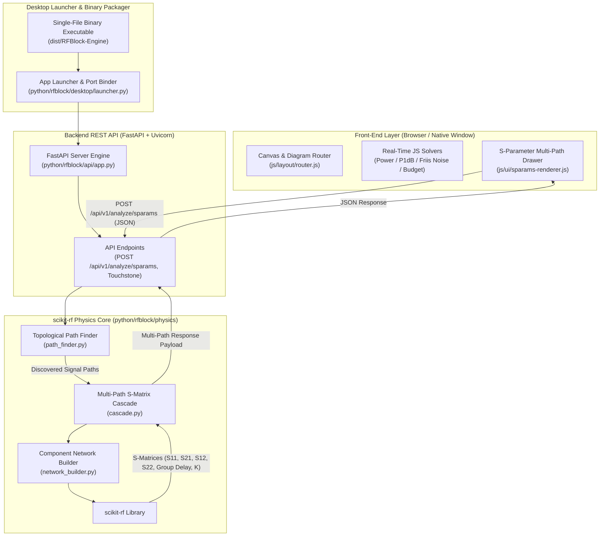

# RF Chain — Block Diagram Editor & S-Parameter Engine

A modern, fast web application for designing, simulating, auditing, and exporting **Radio Frequency (RF) system block diagrams** and **S-parameter physics simulations**.

Built with modular JavaScript (ES6+), SVG rendering, embedded physics solvers, `uv` package management, and native Python `scikit-rf` matrix engines.

---

## 🌟 Key Features

- **Comprehensive RF Component Library**:
  - **Sources & Generators**: CW Signal Sources, LO Oscillators, PLL Synthesizers (with Reference input).
  - **Gain & Loss**: Amplifiers (LNA / PA / Driver), Bypass Amplifiers (Dual-mode active/passive inspired by Mini-Circuits TSY-83LN+), Fixed Attenuators, Digital Control Attenuators (DSA), Limiters, Transmission Lines / Traces.
  - **Filtering**: Fixed Filters (LPF, HPF, BPF, BSF) and Tunable Filters with dynamic response curves and 45° tuning controls.
  - **Frequency Conversion**: Mixers (Down/Up-converters), Frequency Multipliers ($\times N$), Frequency Dividers / Prescalers ($\div N$).
  - **Routing & Switching**: SP1T through SP8T Switches (with `Open (Off)` isolation position), Wilkinson Power Splitters, Combiners, IEEE Std 315 Directional Couplers, Bi-directional Couplers, Power Taps, Hybrid Junctions, Off-page Interconnect tags.
  - **Passive Components**: Ferrite Isolators, 3-Port Circulators, Phase Shifters.
  - **Terminals**: Antennas (Tx/Rx), RF In/Out connectors, Video Power Detectors, 50Ω Dummy Load Terminations.

- **RF Physics & System Solvers**:
  - **$P_{1\text{dB}}$ Compression Solver**: Automatically caps RF signal power output at Output $P_{1\text{dB}}$ compression points ($P_{out} = \min(P_{in} + \text{Gain}, P_{1\text{dB}})$), propagating physically realistic compressed power levels downstream.
  - **Overdrive Warning System**: Highlights overdriven/compressed components in red (`.block.hot`) on the canvas and flags stage warnings in the budget table.
  - **Friis Noise Figure Engine**: Calculates cascaded noise figure stage-by-stage across signal paths.
  - **Topological Graph Path Discovery**: Directed graph solver $G=(V, E)$ automatically discovers all valid signal paths from Sources to Sinks across multi-throw switches, splitters, and parallel channels.
  - **`scikit-rf` Multi-Path Engine**: Full frequency-domain $S$-parameter matrix cascade ($S_{11}, S_{21}, S_{12}, S_{22}$), Group Delay ($\tau_g$), Rollett stability factor ($K$), and Touchstone `.s2p` export.

- **Clean UI & Single-Line Wire Badges**:
  - **Single-Line Power Pills**: Signal level badges format power and units on a clean single line (e.g. `+10.0 dBm`).
  - **Universal Labels Toggle**: Toolbar `Labels` toggle button to instantly turn ON or OFF all wire signal level badges across the canvas and exported graphics.
  - **Distinct Color System**: Category-based soft tints optimized for clean white canvas backgrounds.
  - **Multi-Sheet Hierarchy**: Multi-page subsystem folding and drill-down navigation.

- **Export & Single-File Distribution**:
  - **Single-File Executable Binary**: Packaged into a zero-setup single-file desktop application (`RFBlock-Engine`) that auto-launches local `scikit-rf` physics engine and web UI.
  - **Excel BOM Export**: Generates binary `.xlsx` Bill of Materials workbooks directly in-browser using a built-in Uint8Array ZIP/XLSX generator.
  - **Vector Graphics & Touchstone Export**: Export high-resolution SVG, PNG, and `.s2p` Touchstone files.
  - **Single Distributable File**: Rebuilds into a standalone, zero-dependency single HTML file (`dist/rf-block-diagram-standalone.html`).

---

## 🏛️ System Architecture



---

## 🚀 Getting Started

### Option 1: Single-File Executable App (Zero Setup, Offline, Full Physics Engine)
Run the compiled single-file binary:
```bash
./dist/RFBlock-Engine
```
- Starts embedded FastAPI + `scikit-rf` background engine.
- Automatically launches desktop window / browser UI.
- Zero manual installation or configuration required.

### Option 2: `uv` Development & Run Mode
Use the `uv` package manager for fast, reproducible dependency management:
```bash
# Install & lock dependencies
uv sync

# Run physics unit tests
PYTHONPATH=python uv run python -m unittest discover -s python/rfblock/tests

# Run desktop app with live Python backend
uv run rfblock
```

### Option 3: Standalone Single HTML File
Open `dist/rf-block-diagram-standalone.html` directly in any web browser.

---

## 🛠️ Build & Packaging

To compile the single-file executable app (`RFBlock-Engine`) via `uv` and PyInstaller:

```bash
# Build single-file desktop executable
uv run rfblock-build
```

To rebuild only the HTML bundle after editing JS/CSS source files:

```bash
node build.js
```

---

## 📦 Project Architecture (`python/rfblock/`)

- `python/rfblock/core/`: Resource path loader and standalone bundle resolution.
- `python/rfblock/physics/`:
  - `path_finder.py`: Topological graph path discovery $G=(V, E)$ from Sources to Sinks.
  - `network_builder.py`: Synthesizes 2-port `skrf.Network` objects for block types.
  - `cascade.py`: Multi-path S-parameter matrix cascade ($S_{11}, S_{21}, S_{12}, S_{22}$), Group Delay ($\tau_g$), $K$-factor, and Touchstone exporter.
- `python/rfblock/api/`: FastAPI REST endpoints and Pydantic validation schemas.
- `python/rfblock/desktop/`: Desktop launcher (PyWebView/browser) and PyInstaller packager.
- `python/rfblock/tests/`: Automated physics unit test suite.
- `python/rfblock/cli.py`: CLI entry points (`rfblock`, `rfblock-build`).

---

## 📄 File Format

Diagrams are saved as `.rfbd` (JSON format), storing block configurations, positions, parameter values, multi-sheet structures, and wire routing.

---

## 📜 License

MIT License. Designed for RF system engineers, hardware designers, and communications researchers.
