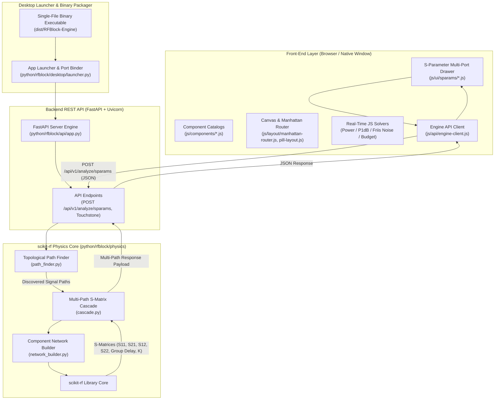

# RF Chain — Block Diagram Editor & S-Parameter Engine

A modern, fast web application for designing, simulating, auditing, and exporting **Radio Frequency (RF) system block diagrams** and **S-parameter physics simulations**.

Built with modular JavaScript (ES6+), SVG rendering, embedded physics solvers, `uv` package management, and native Python `scikit-rf` matrix engines.

---

## 🌟 Key Features

- **Comprehensive RF Component Library**:
  - **Sources & Generators**: CW Signal Sources, LO Oscillators, PLL Synthesizers (with Reference input).
  - **Gain & Loss**: Amplifiers (LNA / PA / Driver), Bypass Amplifiers (Dual-mode active/passive inspired by Mini-Circuits TSY-83LN+), Fixed Attenuators, Digital Control Attenuators (DSA), Limiters, Transmission Lines / Traces.
  - **Filtering**: Fixed Filters (LPF, HPF, BPF, BSF) and Tunable Filters with dynamic response curves and 45° tuning controls.
  - **Frequency Conversion**: Mixers (Down/Up-converters), Frequency Multipliers ($\times N$), Frequency Dividers / Prescalers ($\div N$).
  - **Routing & Switching**: SP1T through SP8T Switches (with `Open (Off)` isolation position), Wilkinson Power Splitters, Combiners, IEEE Std 315 Directional Couplers, Bi-directional Couplers, Power Taps, Hybrid Junctions, Off-page Interconnect tags.
  - **Passive Components**: Ferrite Isolators, 3-Port Circulators, Phase Shifters.
  - **Terminals**: Antennas (Tx/Rx), RF In/Out connectors, Video Power Detectors, 50Ω Dummy Load Terminations.

- **RF Physics & System Solvers**:
  - **$P_{1\text{dB}}$ Compression Solver**: Automatically caps RF signal power output at Output $P_{1\text{dB}}$ compression points ($P_{out} = \min(P_{in} + \text{Gain}, P_{1\text{dB}})$), propagating physically realistic compressed power levels downstream.
  - **Overdrive Warning System**: Highlights overdriven/compressed components in red (`.block.hot`) on the canvas and flags stage warnings in the budget table.
  - **Friis Noise Figure Engine**: Calculates cascaded noise figure stage-by-stage across signal paths.
  - **Topological Graph Path Discovery**: Directed graph solver $G=(V, E)$ automatically discovers all valid signal paths from Sources to Sinks across multi-throw switches, splitters, and parallel channels.
  - **`scikit-rf` Multi-Path Engine**: Full frequency-domain $S$-parameter matrix cascade ($S_{11}, S_{21}, S_{12}, S_{22}$), Group Delay ($\tau_g$), Rollett stability factor ($K$), and Touchstone `.s2p` export.

- **Clean UI, 10 px Grid & Smart Pill Stacks**:
  - **4-Indicator Wire Stack System**: Symmetrically renders Primary Power ($P_{wr1}$), Secondary Power ($P_{wr2}$), Cascaded Noise Figure ($\text{NF}$), and Thermal Noise Floor ($N_{floor}$) badges directly on signal paths.
  - **10 px Fine Grid Snapping**: Canvas grid features $10\times 10\text{ px}$ minor divisions and $100\times 100\text{ px}$ major divisions, providing fine $10\text{ px}$ snap resolution for components, wire routing, and keyboard nudges.
  - **Dynamic Symbol Label Clearance**: Smart positioning engine (`blockLabelY`) dynamically adjusts vertical placement of symbol labels (`val`, `name`, `info`) above and below blocks to prevent collisions with multi-indicator pill stacks, while preserving tight spacing when single pills are shown. Supports independent floating drag offsets.
  - **Universal Labels Toggle**: Toolbar `Labels` toggle button to instantly turn ON or OFF all wire signal level badges across the canvas and exported graphics.
  - **Distinct Color System**: Category-based soft tints optimized for clean white canvas backgrounds.
  - **Multi-Sheet Hierarchy**: Multi-page subsystem folding and drill-down navigation.

- **Export & Single-File Distribution**:
  - **Native Microsoft Visio VSDX Export**: Directly generates fully editable native `.vsdx` drawing packages conforming to OpenXML drawing standards with vector shapes, connection points, and 10 pt typography without third-party dependencies.
  - **Always Tightly Cropped Exports**: SVG, PNG, and Visio VSDX exports always tightly crop to the authored diagram bounding box with clean padding margins ($24\text{ px}$ at 96 DPI), keeping graphics unclipped, distortion-free, and ready for Word or publication embedding, while canvas layout presets (e.g. A4 Portrait) serve as on-screen design guidelines.
  - **Single-File Executable Binary**: Packaged into a zero-setup single-file desktop application (`RFBlock-Engine`) that auto-launches local `scikit-rf` physics engine and web UI.
  - **Excel BOM Export**: Generates binary `.xlsx` Bill of Materials workbooks directly in-browser using a built-in Uint8Array ZIP/XLSX generator.
  - **Vector Graphics & Touchstone Export**: Export high-resolution SVG, PNG, and `.s2p` Touchstone files.
  - **Single Distributable File**: Rebuilds into a standalone, zero-dependency single HTML file (`dist/rf-block-diagram-standalone.html`).

---

## 🏛️ System Architecture


```mermaid
flowchart TD
    subgraph UI ["Front-End Layer (Browser / Native Window)"]
        Components["Component Catalogs<br/>(js/components/*.js)"]
        Canvas["Canvas & Manhattan Router<br/>(js/layout/manhattan-router.js, pill-layout.js)"]
        Solvers["Real-Time JS Solvers<br/>(Power / P1dB / Friis Noise / Budget)"]
        Drawer["S-Parameter Multi-Port Drawer<br/>(js/ui/sparams/*.js)"]
        Client["Engine API Client<br/>(js/api/engine-client.js)"]
    end

    subgraph Desktop ["Desktop Launcher & Binary Packager"]
        Binary["Single-File Binary Executable<br/>(dist/RFBlock-Engine)"]
        Launcher["App Launcher & Port Binder<br/>(python/rfblock/desktop/launcher.py)"]
    end

    subgraph API ["Backend REST API (FastAPI + Uvicorn)"]
        FastAPI["FastAPI Server Engine<br/>(python/rfblock/api/app.py)"]
        Routes["API Endpoints<br/>(POST /api/v1/analyze/sparams, Touchstone)"]
    end

    subgraph Physics ["scikit-rf Physics Core (python/rfblock/physics)"]
        PathFinder["Topological Path Finder<br/>(path_finder.py)"]
        NetBuilder["Component Network Builder<br/>(network_builder.py)"]
        Cascade["Multi-Path S-Matrix Cascade<br/>(cascade.py)"]
        SKRF["scikit-rf Library Core"]
    end

    Drawer --> Client
    Client -->|"POST /api/v1/analyze/sparams (JSON)"| Routes
    Binary --> Launcher
    Launcher --> FastAPI
    FastAPI --> Routes
    Routes --> PathFinder
    PathFinder -->|"Discovered Signal Paths"| Cascade
    Cascade --> NetBuilder
    NetBuilder --> SKRF
    SKRF -->|"S-Matrices (S11, S21, S12, S22, Group Delay, K)"| Cascade
    Cascade -->|"Multi-Path Response Payload"| Routes
    Routes -->|"JSON Response"| Client
    Client --> Drawer
```

---

## 🚀 Getting Started

### Option 1: Single-File Executable App (Zero Setup, Offline, Full Physics Engine)
Run the compiled single-file binary:
```bash
./dist/RFBlock-Engine
```
- Starts embedded FastAPI + `scikit-rf` background engine.
- Automatically launches desktop window / browser UI.
- Zero manual installation or configuration required.

### Option 2: `uv` Development & Run Mode
Use the `uv` package manager for fast, reproducible dependency management:
```bash
# Install & lock dependencies
uv sync

# Run physics unit tests
PYTHONPATH=python uv run python -m unittest discover -s python/rfblock/tests

# Run desktop app with live Python backend
uv run rfblock
```

### Option 3: Standalone Single HTML File
Open `dist/rf-block-diagram-standalone.html` directly in any web browser.

---

## 🛠️ Build & Packaging

To compile the single-file executable app (`RFBlock-Engine`) via `uv` and PyInstaller:

```bash
# Build single-file desktop executable
uv run rfblock-build
```

To rebuild only the HTML bundle after editing JS/CSS source files:

```bash
node build.js
```

---

## 🧠 Domain-Modular Architecture & AI-Agentic Maintenance

To enable long-term autonomous maintenance, rapid feature additions, and minimal LLM prompt token consumption, the codebase is decomposed into focused, single-responsibility modules (~50–150 LOC each):

### 1. Front-End Layer (`js/`)
- **`js/components/`**: Domain-specific RF component catalogs:
  - `helpers.js`: Shared math, formatting, and port builders (`cint`, `gsign`, `cplPorts`, `L`).
  - `sources.js`: CW signal sources and LO oscillators.
  - `gain-loss.js`: Amplifiers (LNA/PA), bypass amplifiers, attenuators (fixed/DSA), limiters, transmission lines.
  - `filters.js`: Fixed filters (LPF, HPF, BPF, BSF) and tunable filters.
  - `converters.js`: Mixers, frequency multipliers, frequency dividers.
  - `routing.js`: Switches (SP1T–SP8T), Wilkinson splitters, combiners, directional & bi-directional couplers, interconnects.
  - `passives.js`: Isolators, circulators, phase shifters.
  - `terminals.js`: Antennas, RF In/Out connectors, detectors, 50Ω load terminations.
  - `containers.js`: Hierarchical subsystems, custom blocks, labels.
- **`js/layout/`**: Orthogonal wire routing and badge clearance:
  - `manhattan-router.js`: A* / Manhattan orthogonal path generator and avoidance obstacle routing.
  - `pill-layout.js`: 4-indicator signal stack placement and collision avoidance.
- **`js/io/`**: Document storage and vector exporters:
  - `document-io.js`: Native `.rfbd` JSON serialization and project management.
  - `svg-exporter.js`: Tightly cropped SVG / PNG rendering.
  - `vsdx/`: Microsoft Visio OpenXML exporter pipeline (`templates.js`, `geometry-converter.js`, `shape-builder.js`, `exporter.js`).
- **`js/ui/sparams/`**: S-parameter physics simulation interface:
  - `graph-chart.js`: Multi-trace SVG Cartesian chart renderer.
  - `trace-grid.js`: Path selector and tabular frequency-point inspection grid.
  - `modal-controller.js`: Dialog lifecycle, sweep form binding, and error handlers.
- **`js/api/engine-client.js`**: Decoupled HTTP REST client communicating with the backend FastAPI physics engine.

### 2. Backend & Physics Engine (`python/rfblock/`)
- `python/rfblock/core/`: Resource path loader and standalone bundle resolution.
- `python/rfblock/physics/`:
  - `path_finder.py`: Topological graph path discovery $G=(V, E)$ from Sources to Sinks.
  - `network_builder.py`: Synthesizes 2-port `skrf.Network` objects for block types.
  - `cascade.py`: Multi-path S-parameter matrix cascade ($S_{11}, S_{21}, S_{12}, S_{22}$), Group Delay ($\tau_g$), $K$-factor, and Touchstone exporter.
- `python/rfblock/api/`: FastAPI REST endpoints and Pydantic validation schemas.
- `python/rfblock/desktop/`: Desktop launcher (PyWebView/browser) and PyInstaller packager.
- `python/rfblock/tests/`: Automated physics unit test suite.
- `python/rfblock/cli.py`: CLI entry points (`rfblock`, `rfblock-build`).

### 3. AI-Agentic Maintenance Benefits
- **70–87% Token Reduction**: AI agents inspect and edit isolated domain files (e.g. `filters.js` or `shape-builder.js`) instead of parsing 800–1000 line monoliths.
- **Zero Cross-Subsystem Side Effects**: Edits to component symbols cannot inadvertently break Visio export templates, routing heuristics, or S-parameter chart animations.
- **Dual-Environment Scoping**: Safe browser-global and CommonJS module export compatibility across all files.

---

## 📄 File Format

Diagrams are saved as `.rfbd` (JSON format), storing block configurations, positions, parameter values, multi-sheet structures, and wire routing.

---

## 📜 License

MIT License. Designed for RF system engineers, hardware designers, and communications researchers.
